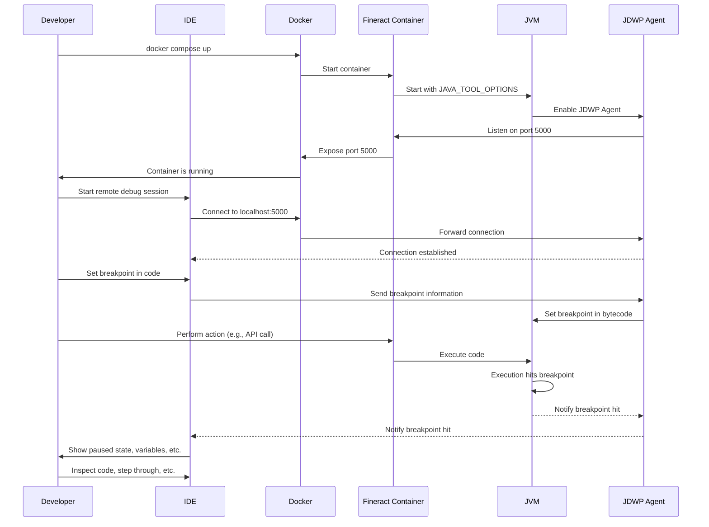

# Remote Debugging Fineract in a Docker Container

This document provides a detailed guide on how to set up and use remote debugging for a Fineract instance running inside a Docker container.

## What is Remote Debugging?

Remote debugging is a technique that allows you to connect your Integrated Development Environment (IDE), such as IntelliJ IDEA or Eclipse, to a running Fineract application that is inside a Docker container. This lets you set breakpoints, step through code, and inspect variables as if the application were running locally on your machine.

This is essential for debugging applications in environments that mimic production, like Docker containers.

## How it Works

Remote debugging works by creating a communication channel between your IDE and the Java Virtual Machine (JVM) running the Fineract application. There are three main components:

1.  **The JDWP Agent:** The Fineract application is started with a special Java agent (`-agentlib:jdwp`). **JDWP** stands for **J**ava **D**ebug **W**ire **P**rotocol. The **Agent** is a component that runs inside the JVM and its only job is to speak the JDWP "language". It acts as a translator or a middleman between your IDE and the JVM. When your IDE sends a command (like "set a breakpoint"), the JDWP Agent translates it into an action the JVM understands. When the JVM hits a breakpoint, the Agent reports it back to your IDE.

2.  **The Exposed Port:** The Docker container that Fineract is running in must expose the port that the JDWP Agent is listening on. This makes the port accessible to your local machine and your IDE.

3.  **The IDE's Remote Debug Configuration:** You configure your IDE to connect to the exposed port on your local machine. Once the connection is established, your IDE can communicate with the JDWP Agent to control the execution of the application.

## Understanding `JAVA_TOOL_OPTIONS`

`JAVA_TOOL_OPTIONS` is a special environment variable that the Java Virtual Machine (JVM) recognizes on startup. It allows you to pass command-line options to the JVM without directly modifying the `java` command that starts the application. This is very useful for configuring the JVM in environments like Docker containers.

The `debug.env` file contains a `JAVA_TOOL_OPTIONS` variable with several options. Let's break them down:

```
JAVA_TOOL_OPTIONS="-Xmx2G -Xms2G -Dlogging.config=/app/logback-override.xml -XX:TieredStopAtLevel=1 -XX:+UseContainerSupport -XX:+UseStringDeduplication -agentlib:jdwp=transport=dt_socket,server=y,suspend=n,address=*:5000 -XX:+UnlockDiagnosticVMOptions -XX:+DebugNonSafepoints -Xlog:jfr=info"
```

*   `-Xmx2G -Xms2G`: These options set the maximum (`-Xmx`) and initial (`-Xms`) heap size for the JVM to 2 gigabytes. This is important for performance.
*   `-Dlogging.config=/app/logback-override.xml`: This sets a Java system property to specify a custom logging configuration file.
*   `-XX:TieredStopAtLevel=1`: This is a performance tuning option for the JVM's tiered compilation.
*   `-XX:+UseContainerSupport`: This tells the JVM to be aware that it is running inside a container and to adjust its resource usage accordingly.
*   `-XX:+UseStringDeduplication`: This is a memory-saving feature that allows the JVM to use the same character array for identical strings.
*   `-agentlib:jdwp=...`: This is the option that enables remote debugging, as explained in the next section.
*   `-XX:+UnlockDiagnosticVMOptions -XX:+DebugNonSafepoints -Xlog:jfr=info`: These options are related to enabling and configuring Java Flight Recorder (JFR), which is a tool for collecting diagnostic and profiling data.

## How to Replicate This Setup (From Scratch)

Imagine the Fineract project was not already configured for remote debugging. Here’s how you would set it up yourself. We'll use port `5005` for this example, which is a common port for Java remote debugging.

### Step 1: Expose the Debug Port

You need to tell Docker to map a port from the container to your local machine. You would do this in the `docker-compose.yml` file (or in this case, `docker-compose-development.yml`).

In the `fineract` service definition, you would add the following to the `ports` section:

```yaml
services:
  fineract:
    # ... other configurations ...
    ports:
      - "8443:8443"
      - "5005:5005" # Add this line for the debug port
    # ... other configurations ...
```

### Step 2: Enable the Java Debugging Agent

You need to tell the JVM to start the debugging agent. The standard way to do this is by setting the `JAVA_TOOL_OPTIONS` environment variable.

You would add the following to the `environment` section of the `fineract` service in your `docker-compose.yml` file, or to an `.env` file that is loaded by the service.

```yaml
services:
  fineract:
    # ... other configurations ...
    environment:
      - JAVA_TOOL_OPTIONS=-agentlib:jdwp=transport=dt_socket,server=y,suspend=n,address=*:5005
    # ... other configurations ...
```

Let's break down the `-agentlib:jdwp` value:

*   `transport=dt_socket`: Specifies that the connection will be a standard socket connection.
*   `server=y`: This tells the agent to listen for an incoming connection from a debugger.
*   `suspend=n`: This is important. It tells the JVM to start the application immediately and not wait for the debugger to connect. If you set this to `y`, the Fineract application would not start until you attach your debugger.
*   `address=*:5005`: This tells the agent to listen on port `5005` on all available network interfaces inside the container.

## How to Use the Pre-configured Setup

The `docker-compose-development.yml` file in this project is already configured for remote debugging on port `5000`.

### The `debug.env` File

The remote debugging configuration is loaded from the `config/docker/env/debug.env` file. The `docker-compose-development.yml` file uses the `env_file` directive to load this file:

```yaml
  fineract:
    # ...
    env_file:
      # ...
      - ./config/docker/env/debug.env
```

Inside the `debug.env` file, you will find the `JAVA_TOOL_OPTIONS` variable that enables the debugging agent.

### 1. Start Fineract in Debug Mode

From the root of the Fineract project, run the following command:

```bash
docker compose -f docker-compose-development.yml up -d
```

### 2. Configure Your IDE

You now need to configure your IDE to connect to the running Fineract application.

#### For IntelliJ IDEA:

1.  Go to **Run** -> **Edit Configurations...**.
2.  Click the **+** button and select **Remote JVM Debug**.
3.  Give the configuration a name, such as "Fineract (Docker)".
4.  Set the **Host** to `localhost`.
5.  Set the **Port** to `5000`.
6.  Click **Apply** and then **OK**.

#### For Eclipse:

1.  Go to **Run** -> **Debug Configurations...**.
2.  Right-click on **Remote Java Application** and select **New Configuration**.
3.  Give the configuration a name, such as "Fineract (Docker)".
4.  Set the **Project** to your Fineract project.
5.  Set the **Host** to `localhost`.
6.  Set the **Port** to `5000`.
7.  Click **Apply** and then **Debug**.

### 3. Start Debugging

1.  Set breakpoints in the Fineract code in your IDE.
2.  Start the remote debug configuration you just created. Your IDE will attach to the Fineract application running in the Docker container.
3.  Perform an action in the Fineract application (e.g., through the API or the Mifos UI) that will trigger the code where you set your breakpoint.
4.  The application will pause at your breakpoint, and you can now debug the code as you normally would.

## Remote Debugging Sequence Diagram

This diagram illustrates the entire remote debugging process, from starting the container to hitting a breakpoint.

