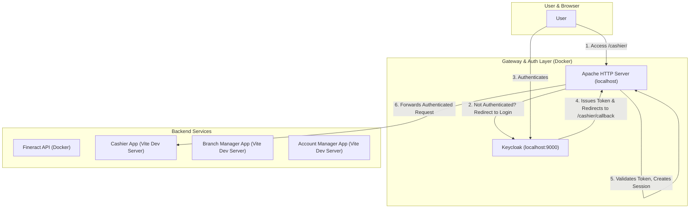

# Apache Proxy, Keycloak, and Multi-App Integration Guide

This document details the setup and configuration of an Apache HTTP Server as a reverse proxy. It acts as a secure gateway for the Fineract backend API and multiple single-page frontend applications, with user authentication handled by Keycloak via OpenID Connect (OIDC).

## 1. Architecture Overview

The goal is to create a single entry point (`http://localhost`) that manages user authentication and seamlessly routes requests to the appropriate backend or frontend development server.



## 2. Core Configuration Files

### 2.1. Apache HTTP Server Configuration (`httpd.conf`)

This is the heart of the reverse proxy. It defines routing rules, security policies, and OIDC integration.

**File:** `fineract/config/apache/httpd.conf`

```apache
# 1. Module Loading: Essential Apache modules are loaded.
LoadModule mpm_event_module modules/mod_mpm_event.so
LoadModule auth_openidc_module modules/mod_auth_openidc.so
LoadModule proxy_module modules/mod_proxy.so
LoadModule proxy_http_module modules/mod_proxy_http.so
LoadModule socache_shmcb_module modules/mod_socache_shmcb.so
LoadModule authn_core_module modules/mod_authn_core.so
LoadModule authz_core_module modules/mod_authz_core.so
LoadModule authz_user_module modules/mod_authz_user.so
LoadModule log_config_module modules/mod_log_config.so
LoadModule unixd_module modules/mod_unixd.so
LoadModule ssl_module modules/mod_ssl.so
LoadModule proxy_connect_module modules/mod_proxy_connect.so
LoadModule rewrite_module modules/mod_rewrite.so
LoadModule proxy_wstunnel_module modules/mod_proxy_wstunnel.so

# 2. Global Server Settings
ServerName localhost
User daemon
Group daemon
Listen 80

# 3. Logging Configuration
LogLevel warn
ErrorLog /proc/self/fd/2
CustomLog /proc/self/fd/1 common


# 4. Virtual Host for All Traffic on Port 80
<VirtualHost *:80>
    # Preserves the original Host header from the client.
    ProxyPreserveHost On

    # 5. Fineract Backend API Proxy Configuration
    SSLProxyEngine on
    SSLProxyVerify none
    SSLProxyCheckPeerCN off
    SSLProxyCheckPeerName off
    ProxyPass /fineract-provider/ https://fineract:8443/fineract-provider/
    ProxyPassReverse /fineract-provider/ https://fineract:8443/fineract-provider/

    # 6. Cashier Frontend App Proxy Configuration
    # WebSocket support for Vite's Hot Module Replacement (HMR)
    RewriteEngine on
    RewriteCond %{HTTP:Upgrade} websocket [NC]
    RewriteCond %{HTTP:Connection} upgrade [NC]
    RewriteRule ^/cashier/(.*) "ws://172.20.0.1:5173/cashier/$1" [P,L]

    # Prevents the OIDC callback from being proxied to the Vite app.
    ProxyPass /cashier/callback !
    # Proxies all other /cashier/ requests to the Vite dev server.
    ProxyPass /cashier/ http://172.20.0.1:5173/cashier/
    ProxyPassReverse /cashier/ http://172.20.0.1:5173/cashier/
    # Rewrites cookie domains and paths for proper session handling.
    ProxyPassReverseCookieDomain 172.20.0.1 localhost
    ProxyPassReverseCookiePath / /cashier/

    # 7. OpenID Connect (OIDC) Configuration
    OIDCCryptoPassphrase a-very-secret-passphrase
    OIDCProviderMetadataURL http://172.20.0.1:9000/realms/fineract/.well-known/openid-configuration
    OIDCClientID web-client
    OIDCClientSecret **********
    OIDCRedirectURI http://localhost/cashier/callback
    
    # OIDC Session Management: Uses a server-side shared memory cache.
    # This is crucial to prevent the "too many redirects" error.
    OIDCSessionType server-cache

    # Sets the OIDC session cookie path to the root for potential SSO.
    OIDCCookiePath /
    # Mitigates CSRF attacks by setting SameSite cookie attribute.
    OIDCCookieSameSite On

    # 8. Protected Location for Cashier App
    # This block triggers OIDC authentication for any request to /cashier/.
    <Location /cashier/>
        AuthType openid-connect
        Require valid-user
    </Location>

</VirtualHost>
```

### 2.2. Docker Compose Service

The `apache-proxy` service is defined in the main `docker-compose.yml` file to build and run the proxy container.

**File:** `docker-compose.yml` (snippet)
```yaml
services:
  # ... other services (db, fineract, keycloak)

  apache-proxy:
    build:
      context: ./fineract/config/apache # Corrected context path
    depends_on:
      - fineract
      - keycloak
    ports:
      - "80:80"
    volumes:
      - ./fineract/config/apache/httpd.conf:/usr/local/apache2/conf/httpd.conf
```

## 3. `httpd.conf` Explained Line-by-Line

#### **1. Module Loading**
-   `LoadModule ...`: These lines load the necessary Apache modules. Key modules for this setup are:
    -   `mod_auth_openidc`: The OpenID Connect module for Keycloak authentication.
    -   `mod_proxy` & `mod_proxy_http`: For acting as a reverse proxy.
    -   `mod_rewrite` & `mod_proxy_wstunnel`: For supporting WebSockets, which Vite's dev server uses for Hot Module Replacement (HMR).
    -   `mod_socache_shmcb`: Provides the shared memory cache used for server-side OIDC sessions.

#### **2. Global Server Settings**
-   `ServerName localhost`: Sets the server's hostname.
-   `User daemon` / `Group daemon`: The user and group Apache runs under.
-   `Listen 80`: Instructs Apache to listen for traffic on port 80.

#### **3. Logging Configuration**
-   `LogLevel warn`: Sets the logging level to `warn`. Changed from `debug` after troubleshooting.
-   `ErrorLog ...` & `CustomLog ...`: Redirects logs to the Docker container's standard output/error streams, making them accessible via `docker logs`.

#### **4. Virtual Host**
-   `<VirtualHost *:80>`: A container for directives that apply to all traffic received on port 80.
-   `ProxyPreserveHost On`: Ensures that the original `Host` header from the client's request is passed to the backend services. This is important for applications that rely on this header.

#### **5. Fineract Backend API Proxy**
-   `SSLProxyEngine on`: Enables the SSL/TLS protocol for proxying.
-   `SSLProxyVerify none` & `SSLProxyCheckPeer* off`: These directives disable certificate validation for the backend Fineract service. **This is acceptable for local development with self-signed certificates but should NEVER be used in production.**
-   `ProxyPass /fineract-provider/ ...`: Forwards any request whose path starts with `/fineract-provider/` to the Fineract backend service (`https://fineract:8443/fineract-provider/`).
-   `ProxyPassReverse /fineract-provider/ ...`: Rewrites the `Location`, `Content-Location`, and `URI` headers in responses from the Fineract backend to match the proxy's address.

#### **6. Cashier Frontend App Proxy**
-   `RewriteEngine on ... RewriteRule ...`: This block specifically handles WebSocket traffic. If a request comes in for `/cashier/` with `Upgrade: websocket` headers, it's proxied to the Vite WebSocket server (`ws://...`). This is essential for HMR to work.
-   `ProxyPass /cashier/callback !`: A crucial directive that creates an exception. It tells Apache **not** to proxy requests for this specific path, allowing `mod_auth_openidc` to handle the authentication callback itself.
-   `ProxyPass /cashier/ ...`: Forwards all other HTTP requests under `/cashier/` to the Cashier app's Vite dev server.
-   `ProxyPassReverse /cashier/ ...`: Rewrites response headers from the Vite server.
-   `ProxyPassReverseCookieDomain ...` & `ProxyPassReverseCookiePath ...`: These rewrite cookies set by the backend service to match the proxy's domain and path structure, ensuring they are correctly handled by the browser.

#### **7. OpenID Connect (OIDC) Configuration**
-   `OIDCCryptoPassphrase ...`: A secret passphrase used for encrypting session data.
-   `OIDCProviderMetadataURL ...`: The URL where the OIDC module can find the Keycloak realm's configuration. The IP `172.20.0.1` is used for the Docker container to communicate with the Keycloak service running on the host.
-   `OIDCClientID` & `OIDCClientSecret`: Credentials for the `web-client` client configured in Keycloak.
-   `OIDCRedirectURI`: The URL that Keycloak will redirect to after a successful login. This must match a valid redirect URI in the Keycloak client settings.
-   `OIDCSessionType server-cache`: Configures `mod_auth_openidc` to store user sessions on the server-side in a shared memory cache. This is the key setting that solved the infinite redirect loop.
-   `OIDCCookiePath /`: Ensures the session cookie is sent for all paths on the domain, which is useful for enabling Single Sign-On (SSO) between different applications under the same proxy.
-   `OIDCCookieSameSite On`: A security measure to help prevent Cross-Site Request Forgery (CSRF) attacks.

#### **8. Protected Location**
-   `<Location /cashier/>`: This block applies authentication rules specifically to requests whose path starts with `/cashier/`.
-   `AuthType openid-connect`: Specifies that OIDC should be used for authentication in this location.
-   `Require valid-user`: Enforces that a user must be authenticated to access this location. This is the directive that triggers the redirect to Keycloak.

---

## 4. Integrating Additional Frontend Apps

You can easily extend this setup to include the `branchmanager-app` and `account-manager-app`. The process is identical for each application. Here is a step-by-step guide.

**Assumption:** We will run the applications on different ports:
-   `cashier-app`: `5173` (already configured)
-   `branchmanager-app`: `5174`
-   `account-manager-app`: `5175`

### 4.0. A Note on Network Accessibility and the `--host` Flag

Before integrating any frontend application, it's critical to understand how the Vite development server interacts with the Dockerized Apache proxy.

By default, when you run `vite` (or `pnpm dev`), the development server only binds to `localhost`. This means it will only accept connections from the same machine (the host). However, our Apache proxy is running inside a separate Docker container, which has its own isolated network environment. From the proxy container's perspective, `localhost` refers to itself, not to your host machine where the Vite server is running.

As a result, if you do not modify the startup command, the Apache proxy will be unable to connect to your Vite server, resulting in a "Connection Refused" or "Bad Gateway" error.

**The Solution: The `--host` Flag**

To solve this, we must modify the `dev` script in each frontend application's `package.json` file:

```json
// Example from frontend/cashier-app/package.json
"scripts": {
  "dev": "vite --host",
}
```

Adding the `--host` flag tells Vite to listen on all available network interfaces (`0.0.0.0`). This makes the development server accessible not just from `localhost` on your host machine, but also from other devices on your network, and most importantly, from the Apache proxy container via the host's internal Docker IP address (e.g., `172.20.0.1`).

**This change is a prerequisite for all frontend applications that need to be accessed through the proxy.**

### 4.1. Integrating the `branchmanager-app`

#### **Step 1: Configure Vite Base Path**

The application needs to know it's being served from a sub-path.

1.  Open `frontend/branchmanager-app/vite.config.ts`.
2.  Add the `base` property to the `defineConfig` section.

```typescript
// frontend/branchmanager-app/vite.config.ts

// ... imports

// https://vitejs.dev/config/
export default mergeConfig(
	baseViteConfig,
	defineConfig({
        base: "/branch/", // <-- ADD THIS LINE
		plugins: [
			tanstackRouter({
				target: "react",
				autoCodeSplitting: true,
			}),
		],
		// ... rest of config
	}),
);
```

#### **Step 2: Update Apache Configuration (`httpd.conf`)**

Add a new set of proxy and authentication rules for the branch manager app.

1.  Open `fineract/config/apache/httpd.conf`.
2.  Add the following code block inside the `<VirtualHost *:80>` section, right after the `cashier-app` configuration.

```apache
    # --- START: Branch Manager App Configuration ---

    # WebSocket support for Vite HMR
    RewriteCond %{HTTP:Upgrade} websocket [NC]
    RewriteCond %{HTTP:Connection} upgrade [NC]
    RewriteRule ^/branch/(.*) "ws://172.20.0.1:5174/branch/$1" [P,L]

    # OIDC Callback - Do not proxy
    ProxyPass /branch/callback !
    # Proxy requests to the Vite dev server for branch manager
    ProxyPass /branch/ http://172.20.0.1:5174/branch/
    ProxyPassReverse /branch/ http://172.20.0.1:5174/branch/
    ProxyPassReverseCookiePath / /branch/

    # Protected Location for Branch Manager App
    <Location /branch/>
        AuthType openid-connect
        Require valid-user
    </Location>

    # --- END: Branch Manager App Configuration ---
```

#### **Step 3: Update Keycloak Redirect URIs**

Your Keycloak client must be configured to accept the new callback URL.

1.  Go to your Keycloak Admin Console.
2.  Navigate to `fineract` realm -> `Clients` -> `web-client`.
3.  In the "Valid Redirect URIs" field, add the new URI: `http://localhost/branch/callback`.
4.  Save the changes.

#### **Step 4: Configure Client-Side Router**

Just as with the cashier app, you must inform TanStack Router about the base path.

1.  Find the router creation logic in your `branchmanager-app` (likely in `src/main.tsx`).
2.  Add the `basepath` option.

```typescript
// Example from frontend/branchmanager-app/src/main.tsx
const router = createRouter({
  routeTree,
  context: { queryClient },
  basepath: "/branch", // <-- ADD THIS LINE
});
```

#### **Step 5: Run the Development Server**

Start the Vite server on the new port.

```bash
# In the frontend/branchmanager-app directory
pnpm dev -- --port 5174
```

You should now be able to access the Branch Manager app at `http://localhost/branch/`, and it will be protected by Keycloak.

### 4.2. Integrating the `account-manager-app`

Follow the exact same steps as above, but use `/account/` as the path and `5175` as the port.

1.  **Vite Config (`frontend/account-manager-app/vite.config.ts`):** Set `base: "/account/"`.
2.  **Apache Config (`fineract/config/apache/httpd.conf`):** Add the corresponding proxy block for `/account/` and port `5175`.
3.  **Keycloak:** Add `http://localhost/account/callback` to the valid redirect URIs.
4.  **Router Config:** Set `basepath: "/account"` in the app's router setup.
5.  **Run Dev Server:** `pnpm dev -- --port 5175`.

By following this pattern, you can seamlessly add and protect any number of frontend applications behind the same Apache proxy with a single, centralized authentication system.