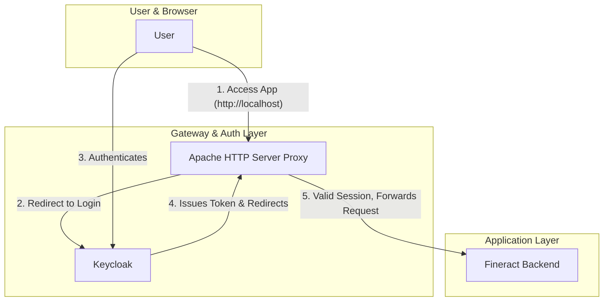

# Apache Proxy and Keycloak Integration Guide

This document details the setup and configuration of an Apache HTTP Server as a reverse proxy in front of the Fineract platform, with authentication handled by Keycloak.

## 1. Architecture Overview

The goal is to create a secure gateway that manages user authentication before allowing access to the Fineract application.



## 2. File Implementation

Three key files are involved in implementing this architecture.

### 2.1. Dockerfile for Apache Proxy

A Dockerfile is used to build a custom Apache image with the necessary OpenID Connect module.

**File:** `config/apache/Dockerfile`

```dockerfile
FROM httpd:2.4

# Install the pre-packaged OpenID Connect module for Apache
RUN apt-get update && \
    apt-get install -y --no-install-recommends \
    libapache2-mod-auth-openidc \
    ca-certificates && \
    apt-get clean && \
    rm -rf /var/lib/apt/lists/* && \
    ln -s /usr/lib/apache2/modules/mod_auth_openidc.so /usr/local/apache2/modules/mod_auth_openidc.so
```

### 2.2. Apache HTTP Server Configuration

This configuration file defines the reverse proxy rules and the OpenID Connect settings for Keycloak integration.

**File:** `config/apache/httpd.conf`

```apache
LoadModule mpm_event_module modules/mod_mpm_event.so
LoadModule auth_openidc_module modules/mod_auth_openidc.so
LoadModule proxy_module modules/mod_proxy.so
LoadModule proxy_http_module modules/mod_proxy_http.so
LoadModule socache_shmcb_module modules/mod_socache_shmcb.so
LoadModule authn_core_module modules/mod_authn_core.so
LoadModule authz_core_module modules/mod_authz_core.so
LoadModule authz_user_module modules/mod_authz_user.so
LoadModule log_config_module modules/mod_log_config.so
LoadModule unixd_module modules/mod_unixd.so

ServerName localhost

User daemon
Group daemon

Listen 80

ErrorLog /proc/self/fd/2
CustomLog /proc/self/fd/1 common

<VirtualHost *:80>
    ProxyPreserveHost On

    ProxyPass / http://fineract:8443/
    ProxyPassReverse / http://fineract:8443/

    OIDCCryptoPassphrase a-very-secret-passphrase
    OIDCProviderMetadataURL http://172.17.0.1:9000/realms/fineract/.well-known/openid-configuration
    OIDCClientID web-client
    OIDCClientSecret **********
    OIDCRedirectURI http://localhost/callback
    
    <Location />
        AuthType openid-connect
        Require valid-user
    </Location>

</VirtualHost>
```

### 2.3. Docker Compose Service Definition

The `apache-proxy` service is added to the main compose file to orchestrate the proxy container.

**File:** `docker-compose.yml`

```yaml
services:
  # ... other services (db, fineract, keycloak)

  apache-proxy:
    build:
      context: ./config/apache
    depends_on:
      - fineract
      - keycloak
    ports:
      - "80:80"
    volumes:
      - ./config/apache/httpd.conf:/usr/local/apache2/conf/httpd.conf
```

## 3. Configuration Explained

### 3.1. Key Directives in `httpd.conf`

*   **`ProxyPass / http://fineract:8443/`**: This is the main proxy rule. It forwards every incoming request (`/`) to the Fineract backend.
    *   It uses the Docker service name `fineract` for container-to-container communication.
    *   It connects to port `8443` using `http`, as the Fineract logs confirm the embedded Tomcat server is configured to listen for HTTP traffic on this port when SSL is disabled.

*   **`OIDCProviderMetadataURL http://172.17.0.1:9000/...`**: This is a crucial setting for container-to-host communication.
    *   The `apache-proxy` container needs to connect to the Keycloak service to fetch its configuration.
    *   Keycloak's port `9000` is exposed on the host machine. From inside a container, `localhost` refers to the container itself. To reach the host, we use the host's IP address on the Docker bridge network (commonly `172.17.0.1`). This allows the proxy to connect to the Keycloak instance.

*   **`<Location />` block**: This section protects the entire site.
    *   `AuthType openid-connect`: Activates OIDC authentication.
    *   `Require valid-user`: Enforces the rule that a user must be authenticated to access any part of the site. This is what triggers the redirect to Keycloak for unauthenticated users.

### 3.2. Verifying the Setup

Since Fineract is a backend API, successfully authenticating and being redirected to `http://localhost/` will result in a `404 Not Found` error. This is expected behavior and indicates the proxy is working correctly.

To confirm the entire flow is functional, access the Swagger UI documentation page, which is served by the Fineract backend:
**`http://localhost/fineract-provider/swagger-ui/index.html`**

Loading this page successfully verifies that authentication and proxying are correctly configured.