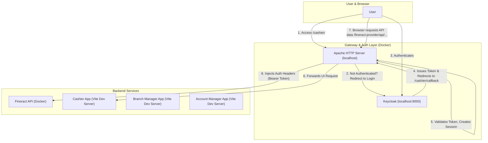

# Apache Proxy, Keycloak, and Multi-App Integration Guide

This document details the setup and configuration of an Apache HTTP Server as a reverse proxy. It acts as a secure gateway for the Fineract backend API and multiple single-page frontend applications, with user authentication handled entirely by the proxy via Keycloak and OpenID Connect (OIDC).

This architecture removes all authentication and token management logic from the frontend applications, making them "auth-dumb" and centralizing security at the gateway level.

## 1. Architecture Overview

The goal is to create a single entry point (`http://localhost`) that:
1.  Intercepts all user traffic.
2.  Manages the entire OIDC authentication flow with Keycloak.
3.  Injects the user's JWT access token into API requests destined for the Fineract backend.
4.  Seamlessly routes requests to the appropriate backend or frontend development server.



## 2. Core Configuration Files

### 2.1. Apache HTTP Server Configuration (`httpd.conf`)

This is the heart of the reverse proxy. It defines routing rules, security policies, OIDC integration, and the logic for injecting authentication headers.

**File:** `fineract/config/apache/httpd.conf`

```apache
# 1. Module Loading: Essential Apache modules are loaded.
LoadModule mpm_event_module modules/mod_mpm_event.so
LoadModule auth_openidc_module modules/mod_auth_openidc.so
LoadModule proxy_module modules/mod_proxy.so
LoadModule proxy_http_module modules/mod_proxy_http.so
LoadModule socache_shmcb_module modules/mod_socache_shmcb.so
LoadModule authn_core_module modules/mod_authn_core.so
LoadModule authz_core_module modules/mod_authz_core.so
LoadModule authz_user_module modules/mod_authz_user.so
LoadModule log_config_module modules/mod_log_config.so
LoadModule unixd_module modules/mod_unixd.so
LoadModule ssl_module modules/mod_ssl.so
LoadModule proxy_connect_module modules/mod_proxy_connect.so
LoadModule rewrite_module modules/mod_rewrite.so
LoadModule proxy_wstunnel_module modules/mod_proxy_wstunnel.so
LoadModule headers_module modules/mod_headers.so

# 2. Global Server Settings
ServerName localhost
User daemon
Group daemon
Listen 80

# 3. Logging Configuration
LogLevel warn
ErrorLog /proc/self/fd/2
CustomLog /proc/self/fd/1 common


# 4. Virtual Host for All Traffic on Port 80
<VirtualHost *:80>
    ProxyPreserveHost On

    # 5. Fineract Backend API Proxy Configuration
    SSLProxyEngine on
    SSLProxyVerify none
    SSLProxyCheckPeerCN off
    SSLProxyCheckPeerName off
    SSLProxyCheckPeerExpire off
    ProxyPass /fineract-provider/ https://fineract:8443/fineract-provider/
    ProxyPassReverse /fineract-provider/ https://fineract:8443/fineract-provider/

    # 6. OpenID Connect (OIDC) Global Configuration
    OIDCCryptoPassphrase a-very-secret-passphrase
    OIDCProviderMetadataURL http://172.17.0.1:9000/realms/fineract/.well-known/openid-configuration
    OIDCClientID web-client
    OIDCClientSecret **********
    
    # OIDC Session Management: Uses a server-side shared memory cache.
    # This is crucial to prevent the "too many redirects" error.
    OIDCSessionType server-cache
    OIDCCookiePath /
    OIDCCookieSameSite On

    # 7. Frontend Application Routing
    # Each app gets its own block for proxying and authentication.

    # --- START: Cashier App Configuration ---
    OIDCRedirectURI http://localhost/cashier/callback
    RewriteEngine on
    RewriteCond %{HTTP:Upgrade} websocket [NC]
    RewriteCond %{HTTP:Connection} upgrade [NC]
    RewriteRule ^/cashier/(.*) "ws://172.20.0.1:5173/cashier/$1" [P,L]
    ProxyPass /cashier/callback !
    ProxyPass /cashier/ http://172.20.0.1:5173/cashier/
    ProxyPassReverse /cashier/ http://172.20.0.1:5173/cashier/
    ProxyPassReverseCookieDomain 172.20.0.1 localhost
    ProxyPassReverseCookiePath / /cashier/
    <Location /cashier/>
        AuthType openid-connect
        Require valid-user
    </Location>
    # --- END: Cashier App Configuration ---

    # --- START: Branch Manager App Configuration ---
    RewriteCond %{HTTP:Upgrade} websocket [NC]
    RewriteCond %{HTTP:Connection} upgrade [NC]
    RewriteRule ^/branch/(.*) "ws://172.20.0.1:5174/branch/$1" [P,L]
    ProxyPass /branch/callback !
    ProxyPass /branch/ http://172.20.0.1:5174/branch/
    ProxyPassReverse /branch/ http://172.20.0.1:5174/branch/
    ProxyPassReverseCookiePath / /branch/
    <Location /branch/>
        AuthType openid-connect
        Require valid-user
    </Location>
    # --- END: Branch Manager App Configuration ---

    # --- START: Account Manager App Configuration ---
    RewriteCond %{HTTP:Upgrade} websocket [NC]
    RewriteCond %{HTTP:Connection} upgrade [NC]
    RewriteRule ^/account/(.*) "ws://172.20.0.1:5175/account/$1" [P,L]
    ProxyPass /account/callback !
    ProxyPass /account/ http://172.20.0.1:5175/account/
    ProxyPassReverse /account/ http://172.20.0.1:5175/account/
    ProxyPassReverseCookiePath / /account/
    <Location /account/>
        AuthType openid-connect
        Require valid-user
    </Location>
    # --- END: Account Manager App Configuration ---

    # 8. Fineract API Token Injection
    # This is the core of the proxy-based auth. It protects API endpoints
    # and injects the necessary headers for Fineract.
    <LocationMatch "^/fineract-provider/api/.*">
        AuthType openid-connect
        Require valid-user
        RequestHeader set Authorization "Bearer %{OIDC_access_token}e"
        RequestHeader set Fineract-Platform-TenantId "default"
    </LocationMatch>

</VirtualHost>
```

### 2.2. Docker Compose Service

The `apache-proxy` service is defined in the main `docker-compose.yml` file to build and run the proxy container.

**File:** `docker-compose.yml` (snippet)
```yaml
services:
  # ... other services (db, fineract, keycloak)

  apache-proxy:
    build:
      context: ./fineract/config/apache
    depends_on:
      - fineract
      - keycloak
    ports:
      - "80:80"
    volumes:
      - ./fineract/config/apache/httpd.conf:/usr/local/apache2/conf/httpd.conf
```

## 3. `httpd.conf` Explained

#### **1. Module Loading**
-   `LoadModule ...`: Key modules for this setup are:
    -   `mod_auth_openidc`: The OpenID Connect module for Keycloak authentication.
    -   `mod_proxy` & `mod_proxy_http`: For acting as a reverse proxy.
    -   `mod_rewrite` & `mod_proxy_wstunnel`: For supporting WebSockets (used by Vite's HMR).
    -   `mod_socache_shmcb`: Provides the shared memory cache for server-side OIDC sessions.
    -   `mod_headers`: **Crucial addition.** This module is required to use the `RequestHeader` directive, which allows us to add/modify request headers.

#### **5. Fineract Backend API Proxy**
-   `SSLProxyEngine on`: Enables the SSL/TLS protocol for proxying.
-   `SSLProxyVerify none` & `SSLProxyCheckPeer* off`: These directives disable certificate validation for the backend Fineract service. `SSLProxyCheckPeerExpire off` was added to prevent checks on certificate expiration. **This is acceptable for local development with self-signed certificates but should NEVER be used in production.**
-   `ProxyPass` & `ProxyPassReverse`: Forward requests to the Fineract backend service.

#### **6. OpenID Connect (OIDC) Global Configuration**
-   `OIDCProviderMetadataURL`: The discovery URL for the Keycloak realm.
    -   **CRITICAL:** The IP `172.17.0.1` is used. This is the Docker host's IP on the default bridge network. The Fineract backend is also configured to trust JWTs issued from this IP. Using a different IP (like `172.20.0.1`) would cause the JWT's `iss` (issuer) claim to be different from what Fineract expects, resulting in a `401 Unauthorized` error. This ensures consistency between the token issuer and the validator.
-   `OIDCClientID` & `OIDCClientSecret`: Credentials for the `web-client` in Keycloak.
-   `OIDCSessionType server-cache`: Configures server-side session storage, which is essential to prevent infinite redirect loops.

#### **7. Frontend Application Routing**
-   **`OIDCRedirectURI`**: This is now defined within each application's configuration block (e.g., `OIDCRedirectURI http://localhost/cashier/callback`). It tells Keycloak where to send the user back to after a successful login for that specific app.
-   **`Rewrite...` block**: Handles WebSocket traffic for Vite's Hot Module Replacement (HMR).
-   **`ProxyPass /<app>/callback !`**: An exception that prevents the OIDC callback URL from being proxied to the frontend app, allowing `mod_auth_openidc` to handle it.
-   **`ProxyPass /<app>/ ...`**: Forwards all other HTTP requests for that app's path to its Vite dev server.
-   **`<Location /<app>/>`**: This block protects the application's path, triggering the OIDC authentication flow for any user who tries to access it.

#### **8. Fineract API Token Injection**
This is the most significant change from a client-side auth model.
-   **`<LocationMatch "^/fineract-provider/api/.*">`**: This block applies its rules to any request whose path matches the given regular expression—in this case, any request to the Fineract API.
-   `AuthType openid-connect` & `Require valid-user`: This ensures that only authenticated users can make API calls. If a user's session has expired, this will trigger a re-authentication flow.
-   **`RequestHeader set Authorization "Bearer %{OIDC_access_token}e"`**: This is the core of the new architecture. For every matched request, it creates an `Authorization` header. The value is constructed with the word "Bearer " followed by the access token (`%{OIDC_access_token}e`) that `mod_auth_openidc` has stored in the user's session. This token is then sent to the Fineract backend, which validates it to authorize the API request.
-   **`RequestHeader set Fineract-Platform-TenantId "default"`**: This adds the required tenant ID header for all API requests.

## 4. Integrating Frontend Apps (Summary)

The configuration in `httpd.conf` is already set up for three applications: `cashier-app`, `branchmanager-app`, and `account-manager-app`. To run them, follow this pattern for each:

#### **Step 0: Ensure Frontend is "Auth-Dumb"**
**This is the most important principle of this architecture.** Before proceeding, you must ensure that your frontend application contains **no authentication logic whatsoever**. The Apache proxy handles 100% of the user authentication flow.

This means your frontend code should **NOT**:
- Store authentication tokens (e.g., in `localStorage` or `sessionStorage`).
- Use interceptors (e.g., with Axios) to add `Authorization` headers to API requests.
- Contain any pages or components for logging in or logging out.
- Handle redirects to Keycloak or process authentication callbacks.

The frontend's only responsibility is to make relative API calls (e.g., `/fineract-provider/api/v1/clients`) as if no authentication exists. The proxy will automatically secure these calls.

#### **Step 1: Configure Vite Base Path**
Ensure the app knows it's being served from a sub-path.

```typescript
// Example: frontend/branchmanager-app/vite.config.ts
defineConfig({
    base: "/branch/", // <-- Must match the proxy path
    // ...
});
```

#### **Step 2: Configure Client-Side Router**
The client-side router (e.g., TanStack Router) must also be aware of the base path.

```typescript
// Example: frontend/branchmanager-app/src/main.tsx
const router = createRouter({
  // ...
  basepath: "/branch", // <-- Must match the proxy path (without trailing slash)
});
```

#### **Step 3: Update Keycloak Redirect URIs**
Your Keycloak `web-client` must be configured to accept all callback URLs.
1.  Go to your Keycloak Admin Console (`http://localhost:9000`).
2.  Navigate to `fineract` realm -> `Clients` -> `web-client`.
3.  Ensure the "Valid Redirect URIs" field contains an entry for each app:
    -   `http://localhost/cashier/callback`
    -   `http://localhost/branch/callback`
    -   `http://localhost/account/callback`

#### **Step 4: Run the Development Server with `--host`**
The Vite server must be accessible from the Docker container.
1.  Modify the `dev` script in the app's `package.json`:
    ```json
    "scripts": {
      "dev": "vite --host",
    }
    ```
2.  Run the server on its designated port:
    ```bash
    # In frontend/branchmanager-app directory
    pnpm dev -- --port 5174

    # In frontend/account-manager-app directory
    pnpm dev -- --port 5175