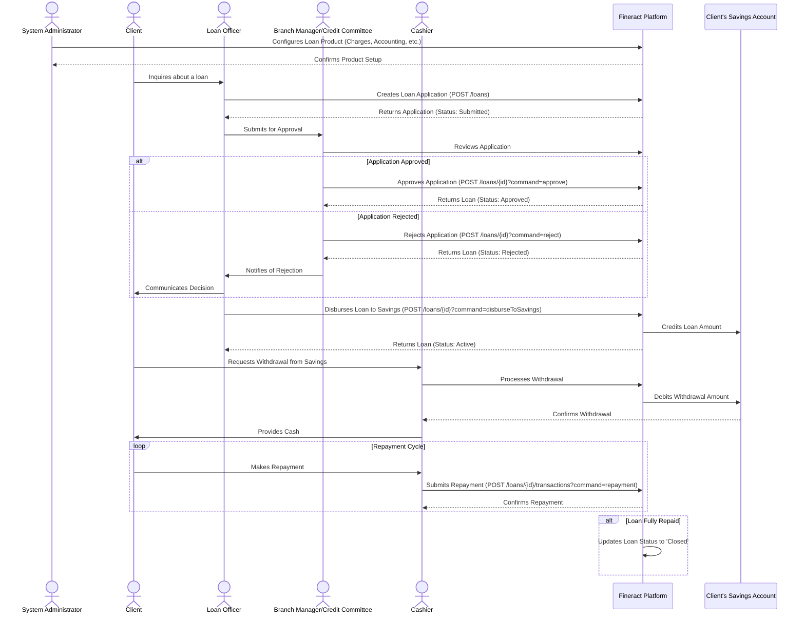

# Fineract Loan System: A Comprehensive Guide

## 1. Introduction

This document provides a detailed overview of the Apache Fineract loan system. It is intended for developers building frontend applications, as well as for training financial institution staff on the core concepts and workflows of loan management within Fineract.

The Fineract loan module is a highly flexible and robust system designed to handle the entire lifecycle of a loan, from initial product configuration to final closure. Its API-driven, modular architecture allows for extensive customization to meet the diverse needs of financial institutions.

---

## 2. Core Concepts

Understanding the following core concepts is essential to working with the Fineract loan system.

### 2.1. Loan Products

A **Loan Product** is a template that defines the rules, constraints, and default settings for a specific type of loan. It is the foundation upon which all loan accounts are built. By creating different loan products, a financial institution can offer a variety of loan types (e.g., "Small Business Loan," "Agricultural Loan," "Personal Loan") without re-configuring the rules for every single application.

A loan product is highly configurable, with attributes grouped into several categories:

#### **Details, Currency, and Terms:**
- **Basic Information:** Name, Short Name, Description, Start/End Dates.
- **Currency:** The currency of the loan, including decimal places.
- **Principal:** The loan amount, defined by default, minimum, and maximum values.
- **Repayments:** The number of installments (default, min, max).
- **Repayment Frequency:** How often repayments are due (e.g., every 1 Month, every 15 Days).
- **Interest Rate:** The nominal interest rate, defined per period (e.g., 1.5% per Month, 18% per Year).
- **Loan Term:** The total duration of the loan, calculated from the number of repayments and their frequency.

#### **Settings:**
- **Amortization:** How the principal and interest are paid back over time.
  - `Equal Installments`: Each payment is the same amount.
  - `Equal Principal Payments`: The principal portion of each payment is the same.
- **Interest Method:** How interest is calculated.
  - `Declining Balance`: Interest is calculated on the outstanding principal balance.
  - `Flat`: Interest is calculated on the original principal amount for the entire loan term.
- **Interest Calculation Period:** How frequently interest is calculated (e.g., Daily, Same as Repayment Period).
- **Transaction Processing Strategy:** The logic that determines how repayments are allocated to different components of the loan (e.g., Penalties, Fees, Interest, Principal). Fineract provides several strategies out-of-the-box.
- **Grace Periods:** Optional periods at the beginning of the loan where repayments are modified. You can define grace periods for:
  - `Grace on Principal Payment`: Only interest is paid.
  - `Grace on Interest Payment`: Only principal is paid.
  - `Grace on All Repayments`: No payments are made (moratorium).

#### **Charges:**
- You can associate specific **Charges** (fees or penalties) with a loan product. These charges can be triggered at different times:
  - `Disbursement`: A one-time fee when the loan is given out.
  - `Specified Due Date`: A fee charged on a specific date.
  - `Installment Fee`: A fee charged with every repayment.
  - `Overdue Installment`: A penalty applied when a repayment is late.

#### **Accounting:**
- This section maps loan events to the institution's General Ledger (GL). It determines how financial transactions are recorded.
- **Accounting Rule:** Can be `None`, `Cash-Based`, or `Accrual-Based` (Upfront or Periodic).
- **Account Mapping:** You must map different loan portfolio components to specific GL accounts, such as:
  - `Fund Source` (Asset)
  - `Loan Portfolio` (Asset)
  - `Interest on Loans` (Income)
  - `Income from Fees` (Income)
  - `Write-Offs` (Expense)

### 2.2. Loan Accounts

A **Loan Account** is a specific instance of a loan product created for a client. It inherits all the rules and defaults from its parent product but holds the specific details of an individual loan agreement, such as the exact principal amount, disbursement date, and repayment schedule.

A loan account progresses through a well-defined lifecycle, represented by its **status**.

#### **Loan Lifecycle and Statuses:**
1.  **Submitted and Pending Approval:** The initial state after a loan application is created. At this stage, all details can be modified.
2.  **Approved:** The loan application has been approved by an authorized user. The terms are now mostly fixed.
3.  **Waiting for Disbursal:** The loan is approved and ready to be disbursed to the client.
4.  **Active:** The loan has been disbursed. This is the state where repayments are made. The loan remains active until it is fully paid off.
5.  **Overpaid:** The client has paid more than the total outstanding balance. The excess amount can be refunded.
6.  **Closed (Obligations Met):** The loan has been fully repaid.
7.  **Closed (Written-Off):** The loan has been declared as a loss and closed.
8.  **Rejected:** The loan application was rejected during the approval stage.
9.  **Withdrawn by applicant:** The client withdrew the application before it was approved.

### 2.3. Loan Schedule

The **Loan Schedule** is a detailed table of all expected repayments for a loan account. It is generated when a loan application is submitted or approved. Each row in the schedule represents an installment and includes:
- Due Date
- Principal Due
- Interest Due
- Fees and Penalties Due
- Total Amount Due for the installment
- Outstanding Loan Balance after the payment

The schedule is automatically recalculated if key loan terms are changed or if events like rescheduling or prepayments occur.

---

### Sequence Diagram

## 3. Loan Application Workflow

The process of taking a loan from application to closure involves several key steps, each corresponding to an API call and typically performed by a user with a specific role.

0.  **System Setup (System Administrator):**
    - Before any loans can be created, a System Administrator must configure the necessary prerequisites. This includes:
        - Setting up the Chart of Accounts.
        - Defining Funds, Charges, Loan Purposes, and Collateral Types.
        - Creating and configuring the Loan Product itself, linking all the above components and defining the accounting rules.

1.  **Submission (Loan Officer):**
    - A loan officer creates a new loan application for a client using a pre-configured loan product.
    - **API Endpoint:** `POST /loans`
    - The request payload contains all the necessary details: `clientId`, `productId`, `principal`, `loanTermFrequency`, `submittedOnDate`, etc.
    - On success, the system creates a new loan account with the status "Submitted and Pending Approval" and generates a prospective repayment schedule.

2.  **Approval (Branch Manager/Loan Officer):**
    - An authorized user reviews the application. They can either approve or reject it.
    - **API Endpoint:** `POST /loans/{loanId}?command=approve`
    - The payload includes the `approvedOnDate` and can optionally override the `approvedLoanAmount`.
    - On success, the loan status changes to "Approved" and then "Waiting for Disbursal."

3.  **Disbursement (Loan Officer):**
    - The approved loan amount is disbursed directly to the client's linked savings or current account. This is a cashless transaction from the perspective of the loan workflow.
    - **API Endpoint:** `POST /loans/{loanId}?command=disburseToSavings`
    - The payload must include the `actualDisbursementDate`.
    - On success, the loan status changes to "Active," and the funds are credited to the client's savings account.

4.  **Withdrawal (Client at Cashier):**
    - The client can then withdraw the disbursed funds from their savings account like any other cash withdrawal.
    - This process is separate from the loan workflow and is handled by the savings account module.

5.  **Repayments (Client/Cashier):**
    - The client makes regular payments against the loan, which are processed by the Cashier.
    - **API Endpoint:** `POST /loans/{loanId}/transactions?command=repayment`
    - The payload includes the `transactionDate` and `transactionAmount`.
    - Each repayment updates the loan schedule, reducing the outstanding principal, interest, and other components according to the defined transaction processing strategy.

6.  **Closure:**
    - Once the `totalOutstanding` on the loan summary becomes zero, the loan is automatically or manually moved to the "Closed (Obligations Met)" status.

4.  **Repayments (Client/Cashier):**
    - The client makes regular payments against the loan.
    - **API Endpoint:** `POST /loans/{loanId}/transactions?command=repayment`
    - The payload includes the `transactionDate` and `transactionAmount`.
    - Each repayment updates the loan schedule, reducing the outstanding principal, interest, and other components according to the defined transaction processing strategy.

5.  **Closure:**
    - Once the `totalOutstanding` on the loan summary becomes zero, the loan is automatically or manually moved to the "Closed (Obligations Met)" status.

---

## 4. Roles and Permissions

Fineract has a granular permission system. For the loan module, the typical roles are:

-   **Loan Officer/Account Manager:** The primary point of contact for the client. Responsible for creating applications, following up on repayments, and managing the loan portfolio.
-   **Branch Manager / Credit Committee:** Has the authority to approve or reject loan applications, often for amounts above a certain threshold.
-   **Cashier:** Handles cash transactions, such as withdrawals from savings accounts and accepting loan repayments. In this workflow, they do not handle the initial loan disbursement.
-   **System Administrator:** Configures loan products, accounting rules, and other system-level settings.

The frontend applications you build should reflect these roles, showing or hiding functionality based on the logged-in user's permissions.

---

## 5. Key API Endpoints Summary

-   **Create Loan Application:** `POST /loans`
-   **Retrieve Loan Details:** `GET /loans/{loanId}`
-   **Update Loan Application:** `PUT /loans/{loanId}` (only before approval)
-   **Approve Application:** `POST /loans/{loanId}?command=approve`
-   **Reject Application:** `POST /loans/{loanId}?command=reject`
-   **Disburse Loan:** `POST /loans/{loanId}?command=disburse`
-   **Undo Disbursal:** `POST /loans/{loanId}?command=undodisbursal`
-   **Make Repayment:** `POST /loans/{loanId}/transactions?command=repayment`
-   **Retrieve Loan Schedule:** `GET /loans/{loanId}?associations=repaymentSchedule`