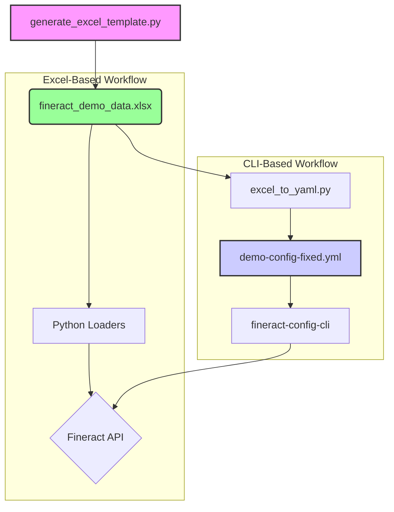

# Fineract Configuration Management Guide

This guide explains how to add new configurations to Fineract using the two available methods: the `fineract-config-cli` (with `demo-config-fixed.yml`) and the Python data-loading scripts (with an Excel file).

## The Relationship Between Excel and YAML

The Excel file generated by `generate_excel_template.py` serves as the primary source of truth for all configurations. The `demo-config-fixed.yml` file used by the `fineract-config-cli` is a derivative of the Excel file, generated by the `excel_to_yaml.py` conversion script.

This means that all configuration changes should be made in the Excel file first, and then converted to YAML to ensure both loading methods remain synchronized.



### Step 1: Add the New Configuration to the Excel Template

1.  **Locate the Relevant Sheet-Creation Function:** Open `generate_excel_template.py` and find the function that creates the sheet for your desired configuration. For example:
    *   **Maker-Checker:** `create_maker_checker_config_sheet`
    *   **Roles and Permissions:** `create_roles_permissions_sheet`
    *   **Users:** `create_users_sheet`

2.  **Add the New Configuration:** Add a new dictionary to the `data` list within the relevant function.

    **Example: Enabling Maker-Checker for a New Operation**

    In the `create_maker_checker_config_sheet` function, add a new entry to the `data` list:

    ```python
    data = [
        # ...
        {
            'task_name': 'Create Savings Account',
            'entity': 'SAVINGSACCOUNT',
            'action': 'CREATE',
            'enabled': True,
            'maker_role': 'Loan Officer',
            'checker_role': 'Branch Manager',
            'description': 'Creating new savings accounts requires manager approval'
        },
        # ...
    ]
    ```

### Step 2: Generate the Excel and YAML Files

1.  **Generate the Excel File:** Run `generate_excel_template.py` to create a new Excel file containing your changes.
2.  **Convert to YAML:** Use the `excel_to_yaml.py` script to convert the new Excel file into `demo-config-fixed.yml`.

### Step 3: Run the Loaders

You can now use either of the following methods to apply your configurations:

*   **Python Loaders:** Run the main Python data-loading script with the newly generated Excel file.
*   **fineract-config-cli:** Run the `fineract-config-cli` tool, which will use the updated `demo-config-fixed.yml`.

## How to Convert the Excel File to YAML

The `excel_to_yaml.py` script is a command-line tool that reads the generated Excel file and outputs a YAML file that is compatible with the `fineract-config-cli`.

### Prerequisites

*   Python 3
*   `pandas` and `pyyaml` libraries installed. You can install them with pip:
    ```bash
    pip install -r requirements.txt
    ```

### Usage

1.  **Navigate to the scripts directory:**
    ```bash
    cd fineract-adorsys-data-collection/fineract-demo-data/scripts
    ```

2.  **Run the conversion script:**
    ```bash
    python3 excel_to_yaml.py -i ../output/<your_excel_file>.xlsx -o ../../fineract-config-cli/config/demo-config-fixed.yml
    ```

    *   Replace `<your_excel_file>.xlsx` with the name of the Excel file you generated.
    *   The output path is set to overwrite the existing `demo-config-fixed.yml` file, ensuring the CLI uses the latest configurations.

### How It Works

The script reads each sheet from the Excel file and transforms the data into the specific YAML structure expected by the `fineract-config-cli`. It handles data type conversions, such as dates and booleans, and maps the Excel column names to the corresponding YAML keys.

By following this process, you can maintain a single source of truth in your Excel file while still being able to use both the Python loaders and the `fineract-config-cli` to provision your Fineract instance.
