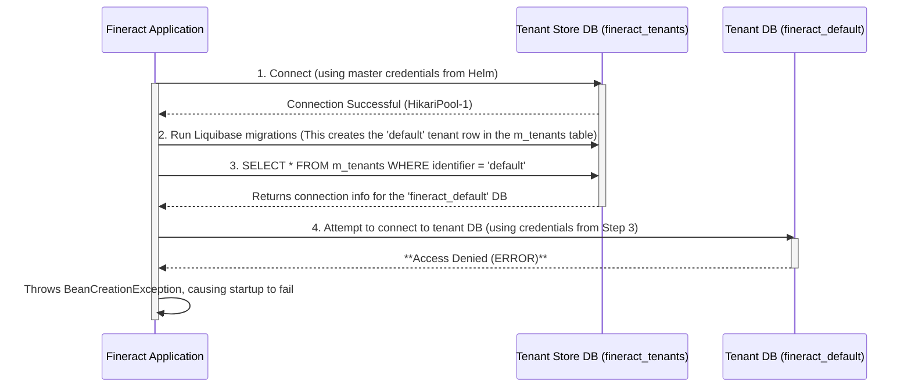

# Fineract Multi-Tenancy and Database Debugging Guide

This document explains Apache Fineract's multi-tenant database architecture, how it behaves during application startup, and provides a deep dive into a common and complex database connection issue encountered when deploying Fineract using the Bitnami Helm chart for MariaDB.

## 1. The Multi-Tenant Architecture

Fineract is designed to serve multiple organizations (tenants) from a single running instance. To achieve the necessary data isolation and security, it does **not** use a single large database. Instead, it uses a hybrid model involving two distinct types of databases.

### The "Lobby Directory" vs. The "Apartments"

An effective analogy is to think of a Fineract instance as an apartment building:

*   **The Tenant Store (`fineract_tenants`):** This is the **Lobby Directory**. It's a small, simple database whose only job is to maintain a master list of all tenants in the building. It doesn't contain any sensitive tenant data, but it knows who the tenants are and holds the "keys" (database connection info) to their individual apartments.
*   **The Tenant Database (`fineract_default`, etc.):** These are the **Apartments**. Each tenant gets their own private, locked database containing all of their specific business data (clients, loans, ledgers, etc.). This ensures one tenant can never see another tenant's data.

For a default installation, we only provision one "apartment"—a tenant with the identifier `default` and its corresponding database, `fineract_default`.

## 2. The Startup and Connection Flow

The startup process involves a critical two-step database connection sequence. Understanding this flow is key to diagnosing the problem.

## 3. Analysis of the Startup Failure

As the diagram shows, the application successfully connects to the `fineract_tenants` database. The failure occurs on the **second connection attempt** to the tenant-specific `fineract_default` database.

### The Error Log Evidence

The Fineract log clearly shows this sequence:
1.  The first connection pool (`HikariPool-1`) starts successfully.
2.  The `TenantDatabaseUpgradeService` logs that it is "Upgrading tenant store DB". This succeeds.
3.  It then logs "Upgrading all tenants" and "Upgrade for tenant default has started".
4.  A second connection pool (`HikariPool-2`) attempts to start.
5.  Immediately, we see the warning from the MariaDB JDBC driver: `Error: 1044-42000: Access denied for user 'fineract'@'%' to database 'fineract_default'`.
6.  This database exception triggers a chain reaction of `BeanCreationException` errors in Spring, ultimately causing the application to crash.

### Key Classes Involved

*   `TenantDatabaseUpgradeService.java`: This Spring service (`@Service`) orchestrates the entire startup migration process. Its `afterPropertiesSet()` method is the entry point that kicks off the two-phase upgrade (`upgradeTenantStore()` then `upgradeIndividualTenants()`).
*   `TenantDataSourceFactory.java`: This class is called by `TenantDatabaseUpgradeService`. Its job is to create a brand new `HikariDataSource` (connection pool) for each individual tenant based on the connection properties stored in the `fineract_tenants` database. This is the class that triggers the failing connection attempt.

## 4. The Root Cause: A Fundamental Conflict

The problem is not a simple missing `GRANT` statement. It is a fundamental conflict between Fineract's expectations and the Bitnami MariaDB Helm chart's security model.

1.  **Fineract's Expectation:** The Fineract database schema is designed with the assumption that the application's primary database user is highly privileged (like `root`). During the initial migration on the `fineract_tenants` database, a Liquibase script inserts the `default` tenant's connection details into the `m_tenants` table. It logically assumes that the credentials it writes for the `default` tenant will be powerful enough to connect to the `fineract_default` database and manage it. In the original `@kubernetes` setup, this user was `root`, so this assumption held true.

2.  **Bitnami Chart's Reality:** The Bitnami MariaDB chart, for excellent security reasons, does not use `root` for applications. It creates a less-privileged user (in our case, `fineract`) and grants it permissions **only** on the primary database (`fineract_tenants`).

### The Vicious Cycle

When Fineract starts up with our Helm chart:
*   It connects to `fineract_tenants` as the `fineract` user.
*   It writes the `fineract` user's credentials into the `m_tenants` table as the credentials for the `default` tenant.
*   It then tries to connect to the `fineract_default` database using these same `fineract` credentials.
*   This fails because the `fineract` user was never given permissions on the `fineract_default` database by the Bitnami chart.

Our attempts to fix this by adding `GRANT` statements in the `initdb` scripts have failed. This strongly implies a timing or context issue within the Bitnami container's startup logic—the `GRANT` commands are likely not being applied effectively before the Fineract application starts and attempts its second connection. The application starts too fast, and the permissions are not yet in place for the new connection pool.
